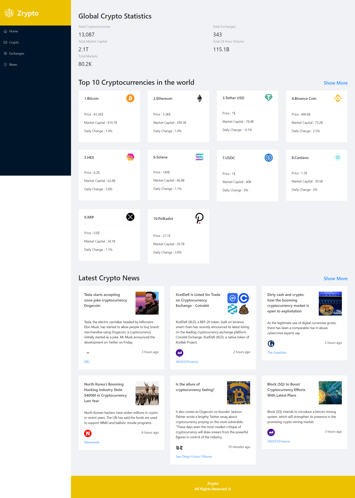

# Crypto-Dashboard

 State Management using Redux Toolkit, UI Creation using Ant Design, creating charts using Chart.js, and fetching data from multiple sources using RapidAPI while building a top notch Cryptocurrency App.
 
 
